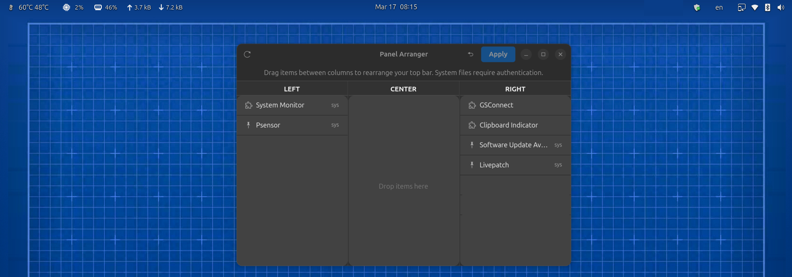

# Panel Arranger

A GTK4/libadwaita GUI tool for rearranging GNOME Shell top bar items between left, center, and right zones.



## What it does

- Discovers all panel indicators: both GNOME Shell extensions and AppIndicator tray icons (PSensor, update notifier, etc.)
- Shows their current position (left / center / right)
- Lets you drag-and-drop items between zones
- Patches the relevant JavaScript files with `pkexec` for system files
- Creates `.panel-arranger.bak` backups before any edit
- Remembers your layout in `~/.config/panel-arranger/config.json`
- Refresh button to rescan live panel state without restarting the app

## Install

```bash
cd panel-arranger
chmod +x install.sh
./install.sh
```

Installs to `/opt/panel-arranger` and adds a **Panel Arranger** entry to your app menu.

Or just run directly:

```bash
python3 panel_arranger.py
```

## Requirements

- GNOME Shell 46 (Ubuntu 24.04)
- Python 3, GTK4, libadwaita (all pre-installed on Ubuntu 24.04)
- `pkexec` for editing system extension files

## How it works

**For GNOME Shell extensions:** patches `addToStatusArea()` calls in each extension's `extension.js` to specify the target panel box and index.

**For AppIndicator tray icons:** patches `indicatorStatusIcon.js` in the active appindicator extension (`ubuntu-appindicators@ubuntu.com` or `appindicatorsupport@rgcjonas.gmail.com`) to route specific icons by name to the chosen panel zone.

After applying changes, log out and back in (Wayland) or press Alt+F2 → `r` (X11).

## Restore

Click the **undo button** in the header bar to restore all `.panel-arranger.bak` backup files, or manually:

```bash
sudo cp /path/to/extension.js.panel-arranger.bak /path/to/extension.js
```

If tray icons have disappeared and the backup restore doesn't help, use the emergency restore script to reinstall the clean file directly from the Ubuntu package:

```bash
bash emergency_restore.sh
```

## Notes

- System extensions (`/usr/share/...`) require authentication via pkexec
- Package updates may overwrite patched files — use `sudo apt-mark hold gnome-shell-extension-appindicator` to prevent this
- Session-mode extensions (like ubuntu-appindicators) can only be patched in the system directory
